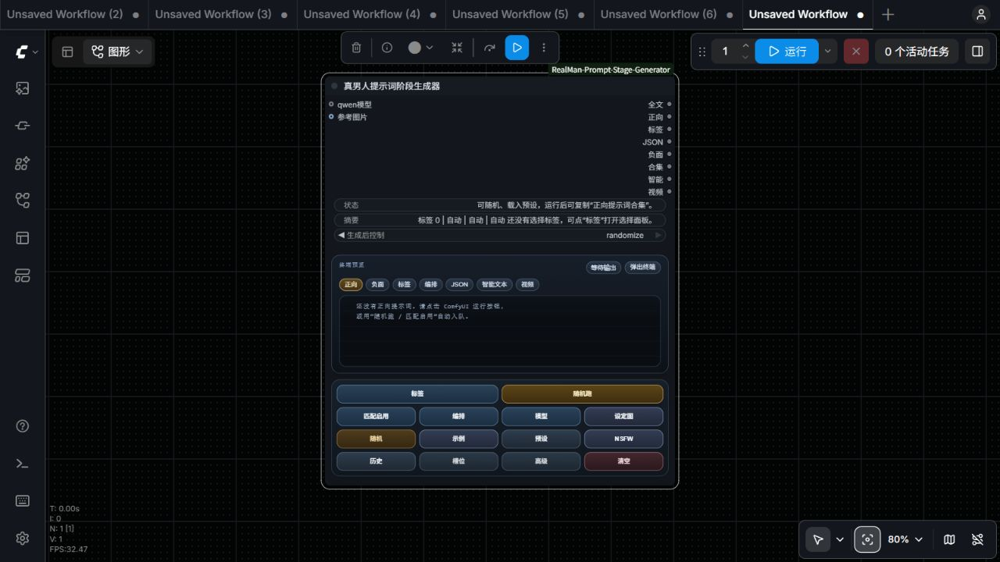
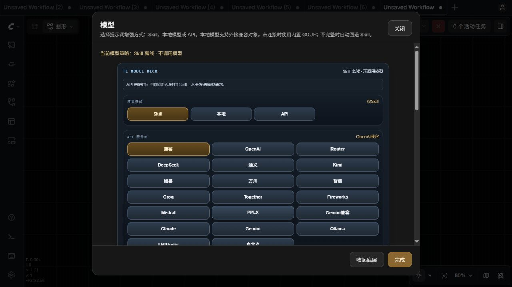
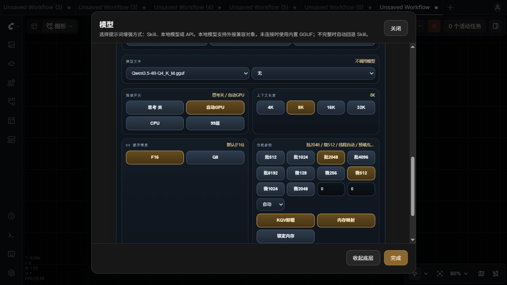
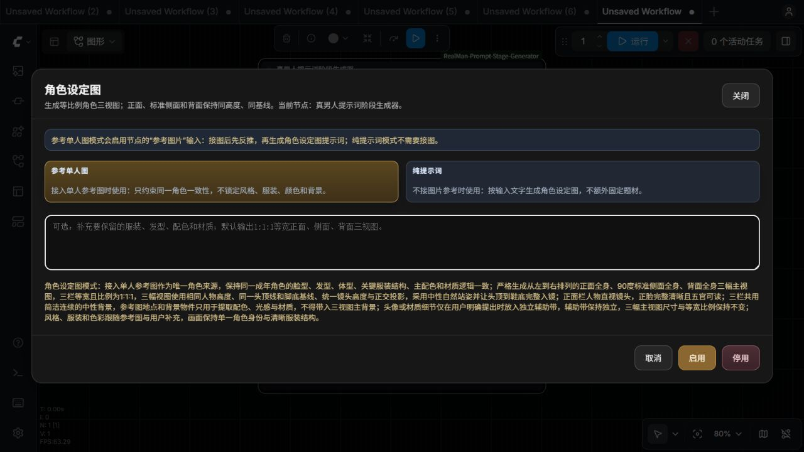
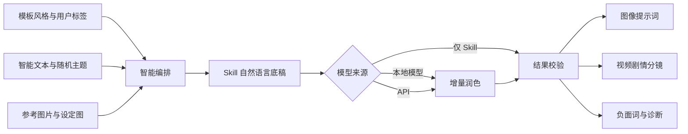

# 真男人提示词阶段生成器

一个面向 ComfyUI 的可视化提示词编排节点。它把模板风格、用户标签、智能文本、运行时随机、参考图片、本地模型和云端 API 统一到同一条创作主线中，生成可直接用于图像与视频工作流的自然语言提示词。

| 项目 | 值 |
| --- | --- |
| 节点名称 | `真男人提示词阶段生成器` |
| 节点分类 | `Qwen TE` |
| 节点标识 | `RealMan_StagePromptGenerator` |



新建工作流请使用 `RealMan_StagePromptGenerator`。前端仍识别旧的 `QwenTE_StagePromptGenerator` 类型，以便读取旧缓存和提供迁移提示；后端注册表只提供新的英文标识。

## 界面速览

| 主界面与八个输出 | 模型来源与 API 服务商 |
| --- | --- |
|  |  |

| 本地模型参数 | 角色设定图 |
| --- | --- |
|  |  |

截图对应当前节点界面。不同 ComfyUI 版本的面板尺寸可能略有差异，但节点标识、输出顺序和模型链路保持一致。

## 为什么使用它

- **不是标签拼接器**：将主体、动作、服装、场景、道具、光影和镜头整理为完整自然语言。
- **图像与视频分别生成**：图像保持单一决定性瞬间；视频按连续分镜推进一段完整剧情。
- **三种运行方式**：仅 Skill、本地模型、API 接口可以随时切换，输出合同保持一致。
- **失败仍有结果**：模型超时、连接失败、格式错误或候选不合格时，自动保留 Skill 成品。
- **减少串词与穿帮**：识别互斥场景、越界道具、无因果换装、人物复制和不合理腾空。
- **支持角色三视图**：参考图反推或纯文本都可生成正面、标准侧面、背面三栏设定图提示词。

## 生成链路



用户明确输入、锁定标签和参考图事实拥有更高优先级。模板、主题池和随机标签只补足空缺；模型负责增加可见细节，不允许另起题目。图像、视频、智能文本和批量结果分别校验，避免相互污染。

## 参数快速开始

第一次运行建议保持 `仅Skill / 生成 3 条 / 纯中文 / 标准 / 完整结果 / 平衡收敛`，先确认图像提示词、视频分镜和负面词能够正常输出，再按需启用本地模型或 API。模型接入后仍由 Skill 建立底稿和校验锚点，调用失败时会保留可用结果。

完整默认值、范围、联动规则和常用配置方案见 [使用说明书：参数设置完整手册](使用说明书.md#16-参数设置完整手册)。

## 核心功能

| 功能 | 说明 |
| --- | --- |
| 自然语言图像提示词 | 输出有主体关系、空间层次、光线方向和材质反馈的完整正文；可选择通用、Flux、SDXL、Qwen Image、Krea 2 或 Midjourney 目标 Profile |
| 连续视频分镜 | 默认建立场景、事件触发、行动、升级和收束，每段带镜头结构；可切换 1/3/5/7 段镜头与可选时间轴 |
| 智能随机 | 在允许变化的范围内重写主体、场景、镜头或细节，不破坏锁定锚点 |
| 场景关系图 | 检查人物、服装、动作、承重点、道具、地点、光线和机位是否一致 |
| 标签 Skill | 模板风格和用户标签都会进入对应 Skill，保留用户明确选择 |
| 图片反推 | 视觉模型只提取可见事实，再进入与文字生成相同的编排链路 |
| 角色设定图 | 固定 `1:1:1` 等宽的正面、90 度侧面、背面三视图结构 |
| 运行诊断 | 显示模型实际来源、重试、定向修复、Skill 回退及冲突处理原因 |

## 三种模型模式

| 模式 | 适合场景 | 实际行为 |
| --- | --- | --- |
| `仅Skill` | 第一次使用、离线生成、追求稳定 | 不调用模型，直接生成图像、智能文本和视频提示词 |
| `本地模型` | 隐私优先、本机 GGUF 或原始模型 | Skill 先写底稿，再由本地模型增量润色 |
| `API接口` | 使用云端模型、Ollama、LM Studio | 通过原生或兼容协议调用，失败时保留 Skill 结果 |


API 面板内置 OpenAI compatible、OpenAI、OpenRouter、DeepSeek、通义千问 DashScope、Kimi、硅基流动、火山方舟、智谱、Groq、Together、Fireworks、Mistral、Perplexity、Claude、Gemini、Ollama、LM Studio 和自定义服务。

图像提示词目标模型可选择 `通用`、`Flux`、`SDXL`、`Qwen Image`、`Krea 2`、`Midjourney` 或 `自定义`。每个 Profile 都会在 JSON 的 `image_prompt_contract` 中记录推荐组织顺序、正向语言合同、负面词通道和参数策略。Krea 2 使用主体优先的自然语言描述，重点保留镜头、空间、材质和光影关系，不把平台参数写入正向正文。

地址可以填写服务商 `base_url`，也可以填写完整端点。节点会按服务商识别 OpenAI Chat Completions、Responses、Anthropic Messages、Gemini、DashScope 和 Ollama 原生格式；当选择“自定义”或“OpenAI兼容”并填写完整的 `/messages`、`:generateContent` 或 `/api/chat` 端点时，也会自动切换对应协议，避免把一种协议的路径拼到另一种服务商地址上。自动识别结果会写入运行诊断，旧的协议修复说明不会带入下一次运行。OpenAI、DashScope、Anthropic 和 Gemini 若明确返回某个可选采样参数不受支持，节点会移除该字段后有界重试一次；Gemini 深度思考分片不会进入最终提示词。

推荐使用环境变量保存密钥：

```text
env:QWEN_TE_API_KEY
env:DASHSCOPE_API_KEY
```

## 本地模型

内置模型从 `ComfyUI/models/LLM/` 读取：

- 单个 `.gguf` 文件使用 `llama-cpp-python`。
- 含 `config.json`、tokenizer 和 `.safetensors/.bin/.pt/.pth` 权重的目录使用 `transformers`。
- GGUF 视觉模型选择同家族、同版本的 `mmproj`；纯文本任务选择 `无`。
- 原始 Vision 模型使用自己的 processor，不需要 GGUF `mmproj`。

支持自动识别 Qwen3、Qwen3.5、Qwen3.6、Qwen3.8、Gemma4、Llama、Mistral、DeepSeek 和通用模型。节点优先使用模型自带聊天模板；模板缺失时按家族选择兼容格式。主模型和视觉投影会校验家族及精确版本，避免 Qwen3.5 主模型误配 Qwen3.6 `mmproj`。


可在界面中自定义上下文长度、GPU 层数、KV 缓存精度、批处理、微批处理、推理线程、Flash Attention、KQV 卸载、内存映射、锁定内存和 RoPE 参数。高级 JSON 会按后端过滤不支持的键，并保护模型路径、聊天格式等核心参数。

原始 Transformers 模型会在生成前同时参考节点设置和模型 `config.json` 的上下文上限，自动为输出预留可用 token，避免长提示词触发超出上下文的失败。不同 Transformers 版本的 chat template、tokenizer 和 Vision processor 参数签名也会走有界兼容降级；视觉图片始终作为独立 PIL 输入传给 processor，不会被转成字符串或串入提示词。

## 角色三视图


设定图模式生成三个等宽、等高、同基线的完整视图：

1. 正面全身，角色正对镜头，五官可读。
2. 精确 90 度标准侧面全身。
3. 背面全身。

三栏使用统一镜头高度、正交投影和连续中性背景。连接 `参考图片` 后，参考图是唯一角色来源；水印、界面文字和无关背景不会作为角色事实带入。

## 视频剧情分镜

视频输出不是在图像提示词后追加“运镜”。它会生成连续编号的自然语言分镜，并在每段中说明景别或机位、摄影机运动、人物动作、环境反馈和前后镜头关系。

视频提示词目标模型支持 `通用`、`H3`、`Wan`、`LTX`、`Seedance` 和 `自定义`；输入模式支持 `T2V`、`I2V`、`FL2V`、`L2V`、`Ref2V`。正文继续使用自然语言，JSON 额外提供 `video_prompt_profile` 和 `video_storyboard`，记录镜头编号、阶段、空间锚点、连续性交接、音频策略和目标输入模式。`视频提示词镜头段数` 可选单镜头、短动作、标准剧情或长剧情；打开 `视频提示词启用时间轴` 后，非通用 Profile 会在标题和 JSON 中写入连续时间段，默认关闭时不会污染旧工作流。

每个 `video_storyboard` 镜头还拆出 `overall_soundscape`、`dialogue`、`sound_effects` 和 `non_diegetic_music` 四个音频字段，JSON 顶层的 `video_audio` 同步提供首镜头音频合同。图像负面词保留原有 `推荐负面词` 字符串，同时在 JSON 中提供 `negative_core`（重复主体、额外头部、分屏、文字水印、身体结构和布局护栏）与 `negative_optional`（风格、画质和细节抑制词），下游可以先使用核心组再按预算追加可选组。

`model_channel_diagnostics` 会分别记录 `image`、`smart_text` 和 `video` 通道的模型尝试、采纳、回退、实际来源和错误列表。模型失败或候选不合格时，通道状态会明确标记为 `skill_fallback`，不会把图像、智能文本和视频的回退结果混在一起。

系统会检查主体、服装、主场景和关键道具的连续性。新增人物、换装、换景、道具出现或承重点变化必须有明确动作与因果；合理的转场、变身、跳跃、飞行、水下悬停和失重主题仍可正常生成。提示词字数不设硬性上限。

## 安装

### 手动安装

将仓库放到：

```text
ComfyUI/custom_nodes/ComfyUI-RealMan-Prompt-Stage-Generator
```

如果从 GitHub ZIP 解压，目录可能暂时叫 `ComfyUI-RealMan-Prompt-Stage-Generator-main`；请确保最终只保留一份插件目录，且目录名与上面的路径一致。

然后完整关闭并重新启动 ComfyUI。不要只刷新网页，Python 路由和节点定义只有重启后才会重新加载。

### Windows 脚本

| 文件 | 用途 |
| --- | --- |
| `内嵌安装到ComfyUI.bat` | 安装或更新插件，并尽量保留用户配置 |
| `一键检查依赖.bat` | 只检查当前 Python 环境，不安装软件包 |
| `自动补装依赖.bat` | 安装本地模型、图片检查等可选依赖 |

可选依赖：

- `llama-cpp-python`：直接加载 GGUF。
- `transformers`、`accelerate`、`safetensors`：直接加载原始模型。
- `opencv-python`、`rapidocr-onnxruntime`：图片质量检查和 OCR。

只使用 `仅Skill` 时不需要安装这些可选依赖。

## 第一次使用

1. 在 `Qwen TE` 分类中添加 `真男人提示词阶段生成器`。
2. 保持 `模型来源 = 仅Skill`，选择模板风格和少量标签。
3. 点击 ComfyUI 的运行按钮，或使用节点内的 `随机跑`。
4. 将 `首条正向提示词` 连接到下游正向编码，将 `推荐负面词` 连接到负向编码。
5. 确认 Skill 路线正常后，再开启智能文本、随机、参考图、本地模型或 API。

默认配置为 `仅Skill / 生成 3 条 / 纯中文 / 标准 / 完整结果 / 平衡收敛`。

## 八个输出

| 输出 | 用途 |
| --- | --- |
| `结果全文` | 正向、负向和运行状态的可读报告 |
| `首条正向提示词` | 第一条可直接连接下游的正向提示词 |
| `已选标签` | 最终标签与模型、Skill 链路诊断 |
| `JSON结果` | 结构化结果，便于其他节点处理 |
| `推荐负面词` | 针对当前主体和画面结构生成的负面词 |
| `正向提示词合集` | 本次生成的全部正向提示词 |
| `智能文本` | 智能文本解析后的统一结果 |
| `视频提示词` | 连续自然语言剧情分镜 |

## 常见问题

**模型调用失败，为什么仍显示“仅 Skill 回退”？**

这是预期的安全结果。查看 `已选标签` 中的模型与 Skill 链路，可区分地址错误、协议不匹配、失效代理、超时、聊天模板错误和候选校验失败。

**更新后还是旧界面？**

关闭所有 ComfyUI 后端，只保留一份插件目录，重新启动后按 `Ctrl+F5`。标准目录、旧目录和 GitHub ZIP 解压出的 `-main` 目录不能同时启用。

**完整面板没有接管？**

节点会显示 `TE MINI CONSOLE` 备用工具栏。可用 `?qwen_te_mini=1` 强制备用模式，便于排查前端扩展冲突。

**人物为什么会无故腾空？**

默认会根据站、坐、跪、躺、蹲姿态建立唯一承重点。只有明确的跳跃、飞行、水下悬停、失重或剧情承重变化才允许离地。

## 文档

- [完整使用说明书](使用说明书.md)
- [参数设置完整手册](使用说明书.md#16-参数设置完整手册)
- [本地模型排错](使用说明书.md#153-本地模型无法加载)
- [API 接口设置](使用说明书.md#53-api接口)
- [模型候选未采用排错](使用说明书.md#155-模型调用成功但未采用)
- [界面未接管排错](使用说明书.md#151-看不到节点或仍是旧界面)

## 安全与隐私

- 节点不会因队列运行自动搜索网页。
- 自定义 API 地址会执行协议、来源和地址校验。
- 环境变量密钥只发送到允许的目标；自定义来源需要显式授权。
- 预设不会保存 API 密钥和额外认证头，但完整 ComfyUI 工作流会保存控件中的明文值。
- 公开分享工作流前，请清空 API Key、认证头和包含隐私信息的文本。

## 测试

```powershell
python -m unittest discover -s tests -p "test_*.py"
node --test tests/test_stage_prompt_ui_contracts.mjs tests/test_mini_toolbar_contracts.mjs
python -m py_compile nodes.py stage_prompt_generator.py stage_prompt/formatter.py
```

更完整的参数默认值、按钮行为、随机策略、图片反推、视频连续性、NSFW 工作台、预设、历史和排错说明见 [使用说明书.md](使用说明书.md)。
